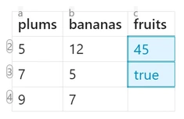
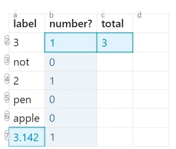

## Short Info

### Features
The plugin is intended to allow usage of formulas in tables, which are computed for the rendered version of the table.
In source mode, or while editing, the formulas are visibile, in live-preview or read mode, the formulas are replaced by computed values.
The plugin treats tables as spreadsheets, translating cells and ranges to the values, expanding and computing if necessary the referenced cells.
The table is divided in columns (labeled from 'a' to 'z', and numerical rows)

After expanding the expressions are evaluated using  [mathjs](https://mathjs.org/docs/reference/functions.html), therefore supporting many functions from there. Ranges between `[ ... ]` are expanded as matrices, and can be used for matrix operations.
### operations
most of the functions from [mathjs](https://mathjs.org/docs/reference/functions.html) are supported.
### Real-time Formula Evaluation in Edit Mode
- **Edit Mode**: Formulas remain visible while editing, with computed values shown as overlays
- **Reading Mode**: Clean display with computed results only

#### Spreadsheet like references
If the result is a vector or a matrix the output will be expanded to multiple cells, and the references for those cells are recomputed.
The references supported are in `[a-z][0-9]+` format (lowercase)
Besides this `a1` reference style, the cells can be referenced using colum-row notation: `[0-9]+c[0-9]r`, where `c` stands for column and `r` stands for row. So for addressing the `b3` cell we could also write `2c3r` (column 2, row 3).
The column-row notation supports also relative referencing by adding a `+` or `-` before the number. 
Combinations of the two are possible:
- `=b+3r` cell at column `b` , 3 rows down.
- `=2c7` cell at column 2 (which is b), row 7
the row-column notation is intended to be used mainly as a relative reference, for example getting the value above the curent cell: `=+0c-1r` (zero columns to the right, the row above)

summing all the values in the curent column from the second row to the cell above the curent one:  `=sum(+0c1:+0c-1r)` 

#### Highlight involved cells
The cells that influence the curent cell, are called `parents`, and the ones that depend on the curent cell are called `children`. Hovering the mouse over a cell, shows both the parents and the children, in customizable colors. This makes it easier to track the flow of data in the sheet. The colors can be customized for the dark theme and for the light theme.
### Highlighting errors
If a cell loops back to itself while trying to be computed, a `loop` error is thrown and displayed. This is also valid for matrix operations, where a cell influences multiple cells.

### Powered by MathJS with Units Support
Formulas are evaluated using [mathjs](https://mathjs.org/docs/reference/functions.html)
- **Native unit parsing**: `5 kg`,  `25 celsius`, `12 inch`
- **Unit arithmetic**: `=5 kg + 3000 g` automatically converts and returns `8 kg`
- **Unit conversion**: `=5 inch to cm` converts between unit systems
- **Matrix operations with units**: Full support for unit calculations in ranges and matrices
### Matrix and Range Operations
Ranges between `[...]` are expanded as matrices and can be used for matrix operations:
- **Standard ranges**: `a1:c3` flattens to a 1D array for functions like `sum()`
- **Matrix ranges**: `[a1:c3]` preserves 2D structure for matrix operations
If the result is a vector or matrix, the output expands to multiple cells, and references for those cells are automatically recomputed.
### Smart Processing Options
- **Class filtering**: Only process tables in files with specific `cssclass` in frontmatter
## Examples
#### Expenses

| Month     | Income      | Rent        | Groceries   | Entertainment | Savings                              |
| --------- | ----------- | ----------- | ----------- | ------------- | ------------------------------------ |
| January   | 1800        | 1000        | 300         | 200           | =[b2:b99]-[c2:c99]-[d2:d99]-[e2:e99] |
| February  | 1700        | 1000        | 310         | 210           | =[b2:b99]-[c2:c99]-[d2:d99]-[e2:e99] |
| March     | 1880        | 1000        | 320         | 220           | =[b2:b99]-[c2:c99]-[d2:d99]-[e2:e99] |
| April     | 1720        | 1000        | 330         | 230           | =[b2:b99]-[c2:c99]-[d2:d99]-[e2:e99] |
| **Total** | =sum(b2:b5) | =sum(c2:c5) | =sum(d2:d5) | =sum(e2:e5)   |                                      |

### simple sum, simple reference
| plums | bananas | fruits |
| ----- | ------- | ------ |
| 5     | 12      | =a2+b2 |

### simple sum, relative reference
`[+-]?[0-9]+r[+-]?[0-9]+c`:
examples:
- `-2c+1r` : two columns left, one row down
- `-0c-1r`: same column, 1 row up

| plums | bananas | fruits             |
| ----- | ------- | ------------------ |
| 5     | 12      | =(-2c+0r)+(-1c+0r) |
| 7     | 5       | =(-2c+0r)+(-1c+0r) |

### combination between letter and relative rows
examples:
`a+1r`: column a, 1 row down

### ranges
| plums | bananas | fruits          |
| ----- | ------- | --------------- |
| 5     | 12      | =sum(a2:b4)     |
| 7     | 5       | =sum(a2:b4) >20 |
| 9     | 7       |                 |

### ranges with relative reference

| plums           | bananas       | fruits        |
| --------------- | ------------- | ------------- |
| 5               | 12            | =sum(1c2:2c4) |
| 7               | 5             | =sum(a2r:b4r) |
| 9               | 7             |               |
| =sum(a2:+0c-1r) | =sum(b2:b-1r) |               |

### vector sum
`ranges in [ ... ]`
formula is only in one cell, but fills values outside of it's cell
values that don't fit in the existing table are disgarded

| plums | bananas | fruits           |
| ----- | ------- | ---------------- |
| 5     | 12      | =[a2:a4]+[b2:b4] |
| 7     | 5       |                  |
| 19    | 10      |                  |

### matrix operations
#### transpose
| m1  |     |     |     |                     |     |     |
| --- | --- | --- | --- | ------------------- | --- | --- |
| 1   | 2   | 3   |     | =transpose([a2:c4]) |     |     |
| 4   | 5   | 6   |     |                     |     |     |
| 7   | 8   | 9   |     |                     |     |     |

#### diagonal

| m1  |     |     |     |                |     |     |
| --- | --- | --- | --- | -------------- | --- | --- |
| 1   | 2   | 3   |     | =diag([a2:c4]) |     |     |
| 4   | 5   | 6   |     |                |     |     |
| 7   | 8   | 9   |     |                |     |     |

#### matrix vector multiplication
| m1  |     |     |     | r1                |     | r2              |     |
| --- | --- | --- | --- | ----------------- | --- | --------------- | --- |
| 1   | 2   | 3   |     | =[a2:c4]\*[1,1,1] |     | =sum(a+0r:c+0r) |     |
| 4   | 5   | 6   |     |                   |     | =sum(a+0r:c+0r) |     |
| 7   | 8   | 9   |     |                   |     | =sum(a+0r:c+0r) |     |

#### determinant
`=det([a2:c4])`

| m1  |     |     |     |               |     |
| --- | --- | --- | --- | ------------- | --- |
| 1   | 2   | 3   |     | =det([a2:c4]) |     |
| 4   | 5   | 7   |     |               |     |
| 7   | 8   | 9   |     |               |     |

### conditionals

| m1  |     |     |     | r1                      |     |     |     |
| --- | --- | --- | --- | ----------------------- | --- | --- | --- |
| 1   | 2   | 3   |     | =([a2:c4]>=5).\*[a2:c4] |     |     |     |
| 4   | 5   | 6   |     |                         |     |     |     |
| 7   | 8   | 9   |     |                         |     |     |     |

#### generate numbers and map them

| decimal                   | hex             | bin             | sin             | isprime             |
| ------------------------- | --------------- | --------------- | --------------- | ------------------- |
| =transpose(range(1,20,2)) | =map([a:a],hex) | =map([a:a],bin) | =map([a:a],sin) | =map([a:a],isPrime) |
|                           |                 |                 |                 |                     |
|                           |                 |                 |                 |                     |
|                           |                 |                 |                 |                     |
|                           |                 |                 |                 |                     |
|                           |                 |                 |                 |                     |
|                           |                 |                 |                 |                     |
|                           |                 |                 |                 |                     |
|                           |                 |                 |                 |                     |
|                           |                 |                 |                 |                     |

### test if it's numeric
| label | number?           | total     |     |
| ----- | ----------------- | --------- | --- |
| 3     | =isNumeric([a:a]) | =sum(b:b) |     |
| not   |                   |           |     |
| 2     |                   |           |     |
| pen   |                   |           |     |
| apple |                   |           |     |
| =pi   |                   |           |     |

### change units
| inch    | cm                  |     |
| ------- | ------------------- | --- |
| 12 inch | =to(unit(a2), "cm") |     |
| 5 inch  | =to(unit(a3), "cm") |     |

### more complex units

| distance | time     | speed         |
| -------- | -------- | ------------- |
| 5 m      | 10 s     | =[a:a]./[b:b] |
| 5 inch   | 10 mins  |               |
| 100 km   | 7 day    |               |
| = 500km  | 0.5 year |               |
|          |          |               |

| initial speed | final spped | time | acc                   |
| ------------- | ----------- | ---- | --------------------- |
| 10 km/h       | 100 km/h    | 10 s | =([b:b]-[a:a])./[c:c] |
| 20 m/s        | 10 m/s      | 5 s  |                       |

|                     |                      |
| ------------------- | -------------------- |
| gravitationConstant | =gravitationConstant |
| planckConstant      | =planckConstant      |

### more complicated dependencies with errors

|                  3                  | 0   | 0   | 0   | e                   | f   |             |
|:-----------------------------------:| --- | --- | --- | ------------------- | --- | ----------- |
|                  1                  | 3   | 4   | 8   | 8                   | 1   |             |
|                  2                  | 5   | 8   | 3   | 8                   | 1   |             |
|                  1                  | 4   | 8   | 3   | 1                   | 1   |             |
|             =sum(f7:g9)             | 3   | 1   |     |                     |     |             |
|                                     |     |     |     |                     |     |             |
|    =diag([a2:c4])\*diag([a2:c4])    |     |     |     | =transpose([a3:c5]) | 0   |             |
| =dotMultiply(diag([a2:c4]),[a2:a4]) |     |     | 3   | 0                   |     |             |
|                                     |     |     |     |                     |     |             |
|                                     |     |     |     |                     |     |             |
|    =dotMultiply([a2:c4],[d2:f4])    |     |     |     |                     |     | =sum(d7:f9) |
|                                     |     |     |     | =sum(a:f)           |     |             |
|                                     |     |     |     |                     |     |             |
|                                     |     |     |     |                     |     |             |

## Configuration and Setup

### Class-based Processing
To not process all notes, you can enable in settings process only pages with a specific `cssclass`.
For that, rightclick on the tab, and select `add file property`, select `cssclasses` and add `calccraft` or the customized value you set in settings.
This allows selective processing - only notes with the specified `cssclasses` will have their tables processed.
### Plugin Settings
- **Decimal precision**: Control number of decimal places (-1 for default)
- **Show labels**: Display row numbers and column letters
- **Formula cell styling**: Borders, colors, and highlighting options
- **Parent/children highlighting**: Colors for dependency visualization
- **Error cell styling**: Visual feedback for formula errors
- **Theme support**: Separate color schemes for light and dark themes
- **Class filtering**: Enable/disable selective processing by cssclass

### Visual Customization
- **Formula cells**: Highlighted with borders and background colors
- **Matrix cells**: Special styling for cells filled by matrix operations
- **Error cells**: Clear visual indication of calculation errors
- **Hover effects**: Dynamic highlighting of cell dependencies
- **Row/column labels**: Optional display of spreadsheet-style coordinates

## Advanced Features

### Edit Mode Support
CalcCraft now provides full edit mode support:
- Formulas remain visible while editing
- Computed values appear as overlays
### Live Preview Integration
- Integration with Obsidian's Live Preview
- Dynamic formula evaluation as you type
- Proper event handling for smooth performance
- Debounced updates to prevent excessive computation
### Performance Optimizations
- Smart caching to avoid unnecessary recalculations
- Edit-aware processing that respects active editing sessions
- Efficient dependency tracking for large tables
- Optimized matrix operations for better performance

### Error Recovery
- Handling of malformed formulas
- Visual indicators for problematic cells
- Prevention of infinite loops in complex dependencies

## Tips and Best Practices

1. **Use relative references** for formulas you want to copy across rows/columns
2. **Hover over cells** to understand dependencies and data flow
3. **Use `[a1:c3]` for matrix operations**, `a1:c3` for simple ranges
4. **Include units in your data** - the plugin handles conversions automatically
5. **Check the browser console** (F12) for detailed debugging information
6. **Use cssclass filtering** if you only need calccraft on specific pages
7. **Test complex formulas incrementally** to identify issues early
