## Short Info

<a href="https://youtu.be/6nSSLsIng8k?autoplay=1)">
    
</a>

### Features
The plugin is intended to allow usage of formulas in tables, which are computed for the rendered version of the table.
In source mode, or while editing, the formulas are visibile, in live-preview or read mode, the formulas are replaced by computed values.
The plugin treats tables as spreadsheets, translating cells and ranges to the values, expanding and computing if necessary the referenced cells.
The table is divided in columns (labeled from 'a' to 'z', and numerical rows)

After expanding the expressions are evaluated using  [mathjs](https://mathjs.org/docs/reference/functions.html), therefore supporting many functions from there. Ranges between `[ ... ]` are expanded as matrices, and can be used for matrix operations.
### operations
most of the functions from 
#### Spreadsheet like references
If the result is a vector or a matrix the output will be expanded to multiple cells, and the references for those cells are recomputed.
The references supported are in `[a-z][0-9]+` format (lowercase)
Besides this `a1` reference style, the cells can be referenced using colum-row notation: `[0-9]c[0-9]r`, where `c` stands for column and `r` stands for row. So for addressing the `b3` cell we could also write `2c3r` (column 2, row 3).
The column-row notation supports also relative referencing by adding a `+` or `-` before the number. 
Combinations of the two are possible:
- `=b+3r` cell at column `b` , 3 rows down.
- `=2c7` cell at column 2 (which is b), row 7
the row-column notation is intended to be used mainly as a relative reference, for example getting the value above the curent cell: `=+0c-1r` (zero columns to the right, the row above)

summing all the values in the curent column from the second row to the cell above the curent one:  `=sum(+0c2:+0c-1r)` 

#### Highlight involved cells
The cells that influence the curent cell, are called `parents`, and the ones that depend on the curent cell are called `children`. Hovering the mouse over a cell, shows both the parents and the children, in customizable colors. This makes it easier to track the flow of data in the sheet. The colors can be customized for the dark theme and for the light theme.
### Highlighting errors
If a cell while trying to be resolved loops back to itself, then a `loop` error is thrown and displayed. This is also valid for matrix operations, where a cell influences multiple cells.

## Examples

#### Expenses
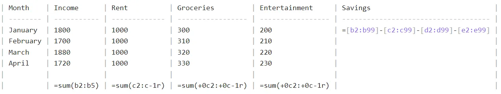
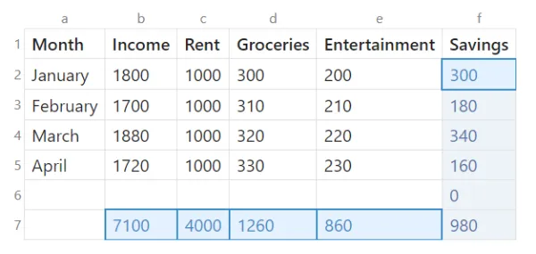

### simple sum, simple reference
```
| plums | bananas | fruits |
| ----- | ------- | ------ |
| 5     | 12      | =a2+b2 |
```
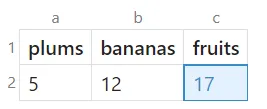

### simple sum, relative reference
`[+-]?[0-9]+r[+-]?[0-9]+c`:
examples:
- `-2c+1r` : two columns left, one row down
- `-0c-1r`: same column, 1 row up

```
| plums | bananas | fruits             |
| ----- | ------- | ------------------ |
| 5     | 12      | =(-2c+0r)+(-1c+0r) |
| 7     | 5       | =(-2c+0r)+(-1c+0r) |
```
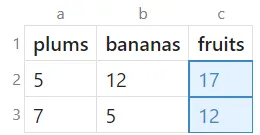
### combination between letter and relative columns
examples:
`a+1r`: column a, 1 row down

### ranges
```
| plums | bananas | fruits          |
| ----- | ------- | --------------- |
| 5     | 12      | =sum(a2:b4)     |
| 7     | 5       | =sum(a2:b4) >20 |
| 9     | 7       |                 |
```

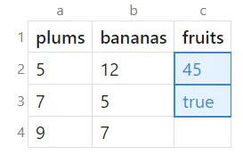
### ranges with relative reference

```
| plums           | bananas       | fruits          |
| --------------- | ------------- | --------------- |
| 5               | 12            | =sum(a2:b4)     |
| 7               | 5             | =sum(a2:b4) >20 |
| 9               | 7             |                 |
| =sum(a2:+0c-1r) | =sum(b2:b-1r) |                 |
```
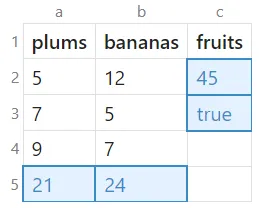
### vector sum
`ranges in [ ... ]`
formula is only in one cell, but fills values outside of it's cell
values that don't fit in the existing table are disgarded

```
| plums | bananas | fruits           |
| ----- | ------- | ---------------- |
| 5     | 12      | =[a2:a4]+[b2:b4] |
| 7     | 5       |                  |
| 19    | 10      |                  |
```

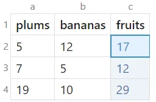
### matrix operations
#### transpose
```
| m1  |     |     |     |                     |     |     |
| --- | --- | --- | --- | ------------------- | --- | --- |
| 1   | 2   | 3   |     | =transpose([a2:c4]) |     |     |
| 4   | 5   | 6   |     |                     |     |     |
| 7   | 8   | 9   |     |                     |     |     |
```

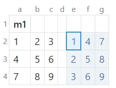
#### diagonal

```
| m1  |     |     |     |                |     | 
| --- | --- | --- | --- | -------------- | --- | 
| 1   | 2   | 3   |     | =diag([a2:c4]) |     | 
| 4   | 5   | 6   |     |                |     | 
| 7   | 8   | 9   |     |                |     | 
```
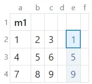
#### matrix vector multiplication
```
| m1  |     |     |     | r1                |     | r2              | 
| --- | --- | --- | --- | ----------------- | --- | --------------- |
| 1   | 2   | 3   |     | =[a2:c4]\*[1,1,1] |     | =sum(a+0r:c+0r) |
| 4   | 5   | 6   |     |                   |     | =sum(a+0r:c+0r) |
| 7   | 8   | 9   |     |                   |     | =sum(a+0r:c+0r) |
```
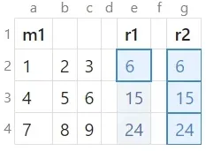
#### determinant
`=det([a2:c4])`

| m1  |     |     |     |               |     |
| --- | --- | --- | --- | ------------- | --- |
| 1   | 2   | 3   |     | =det([a2:c4]) |     |
| 4   | 5   | 7   |     |               |     |
| 7   | 8   | 9   |     |               |     |
### conditionals

```
| m1  |     |     |     | r1                      |     |     |
| --- | --- | --- | --- | ----------------------- | --- | --- |
| 1   | 2   | 3   |     | =([a2:c4]>=5).\*[a2:c4] |     |     | 
| 4   | 5   | 6   |     |                         |     |     |
| 7   | 8   | 9   |     |                         |     |     |
```

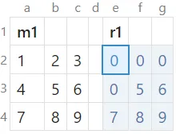
#### generate numbers and map them
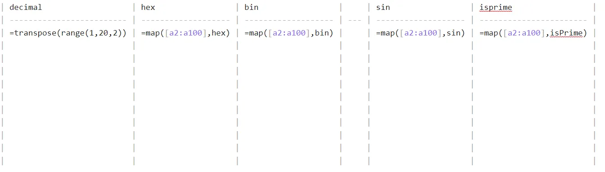
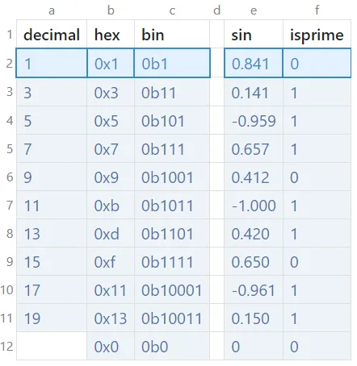
### test if it's numeric
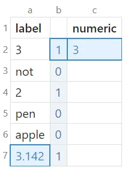

```
| label |                   | numeric   |
| ----- | ----------------- | --------- |
| 3     | =isNumeric([a:a]) | =sum(b:b) |
| not   |                   |           |
| 2     |                   |           | 
| pen   |                   |           |
| apple |                   |           |
| =pi   |                   |           |
```

### change units
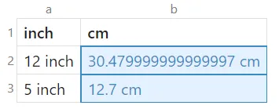

```
| inch    | cm                  |
| ------- | ------------------- |
| 12 inch | =to(unit(a2), "cm") |
| 5 inch  | =to(unit(a3), "cm") | 
```

### more complicated dependencies with errors
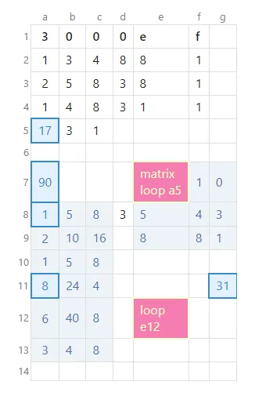

```
|                  3                  | 0   | 0   | 0   | e                   | f   |             |
|:-----------------------------------:| --- | --- | --- | ------------------- | --- | ----------- |
|                  1                  | 3   | 4   | 8   | 8                   | 1   |             |
|                  2                  | 5   | 8   | 3   | 8                   | 1   |             |
|                  1                  | 4   | 8   | 3   | 1                   | 1   |             |
|             =sum(f7:g9)             | 3   | 1   |     |                     |     |             |
|                                     |     |     |     |                     |     |             |
|    =diag([a2:c4])\*diag([a2:c4])    |     |     |     | =transpose([a3:c5]) | 0   |             |
| =dotMultiply(diag([a2:c4]),[a2:a4]) |     |     | 3   | 0                   |     |             |
|                                     |     |     |     |                     |     |             |
|                                     |     |     |     |                     |     |             |
|    =dotMultiply([a2:c4],[d2:f4])    |     |     |     |                     |     | =sum(d7:f9) |
|                                     |     |     |     | =sum(a:f)           |     |             |
|                                     |     |     |     |                     |     |             |
|                                     |     |     |     |                     |     |             |
```
